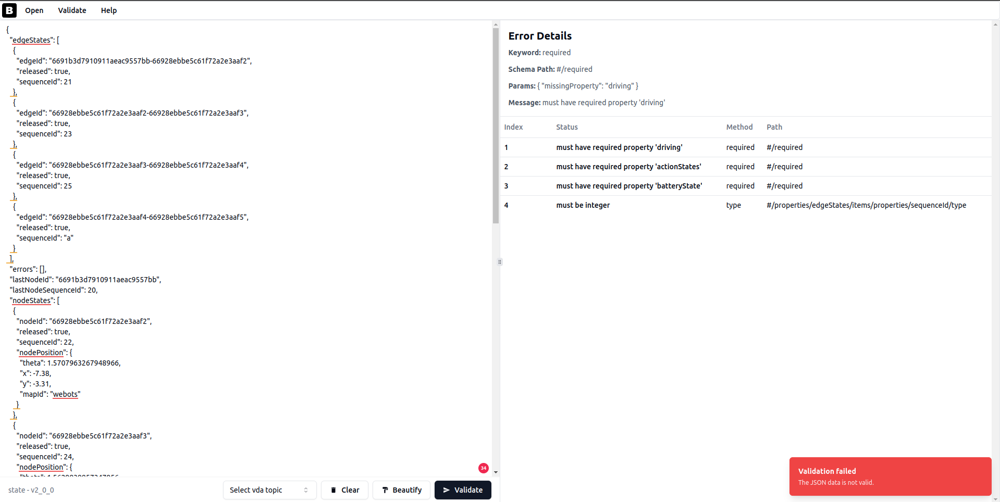

# VDA5050 Message Validator

This is a Vue 3 application designed to validate **VDA5050** messages across different versions (1.1, 2.0, and 2.1). The app supports multiple topics and provides detailed feedback on validation errors, including missing fields, incorrect types, and schema violations.


---

## Features

- **Automatic Topic Detection**: Automatically detects the topic of the provided VDA5050 message.
- **Manual Topic Selection**: Allows users to manually select specific topics for validation.
- **Multi-Version Support**: Validates messages for VDA5050 versions:
  - **1.1**
  - **2.0**
  - **2.1**
- **Detailed Error Reporting**: Displays errors with:
  - Path to the incorrect field
  - Reason for validation failure (e.g., missing property, incorrect type)
- **User-Friendly Interface**: Clear and organized layout to display JSON validation results.

---

## Installation

Follow these steps to set up the project locally:

1. **Clone the Repository**:

   ```bash
   git clone https://github.com/bekirbostanci/vda5050_validator.git
   cd vda5050-validator
   ```

2. **Install Dependencies**:
   Make sure you have Node.js and npm installed, then run:

   ```bash
   npm install
   ```

3. **Run the App**:
   Start the development server:

   ```bash
   npm run dev
   ```

   The app will be accessible at `http://localhost:5173/`.

4. **Build for Production**:
   To build the app for deployment:

   ```bash
   npm run build
   ```

   The compiled output will be in the `dist/` folder.

---

## Usage

1. **Paste JSON Data**: Paste your VDA5050 message JSON into the input area.
2. **Validate**: Click the **Validate** button.
3. **View Results**: Review the validation errors (if any) in the **Error Details** section:
   - **Missing Fields**: Displays required fields that are absent.
   - **Type Errors**: Shows fields with incorrect data types.
   - **Path to Field**: Pinpoints the exact JSON path for the error.

### Example Error Output

- **Missing Required Property**:
  ```
  must have required property 'driving'
  Path: #/required
  ```
- **Type Error**:
  ```
  must be integer
  Path: #/properties/edgeStates/items/properties/sequenceId/type
  ```

---

## Supported Topics

- **state**
- **order**
- **instant actions**
- **factsheet**
- **connection**
- **visualization**

The app allows users to select topics explicitly or automatically detect them.

---

## Dependencies

- **Vue 3**: Frontend framework
- **Vite**: Fast build tool
- **AJV**: Json validator

---

## License

This project is licensed under the MIT License.
